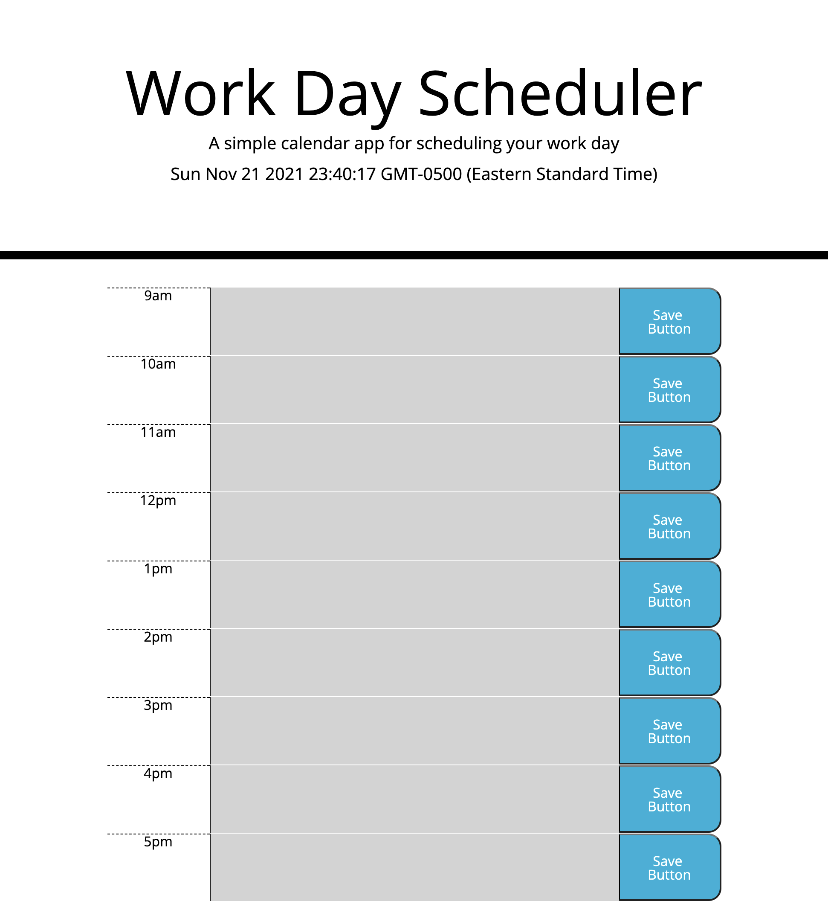

# work-day-scheduler

## Purpose
Create a simple calendar application that allows a user to save events for each hour of the day.

## Built With
* HTML
* CSS
* JS

## Website
https://ajbf92.github.io/work-day-scheduler/

## Contribution
By Alex Betancourt
